# Solar-GLM 파생 분석 재검토

[한국어](README.ko.md) / [English](README.md)

## 요약

기존 분석에서는 Solar와 GLM의 LayerNorm Cosine Similarity 0.99를 근거로 파생 관계를 주장했다. 그러나 대부분의 LLM에서 LayerNorm weight는 학습 후에도 0~1 사이에 분포하여, 모델 간 패턴 차이는 미세한 반면 각 벡터가 공유하는 평균 방향이 내적을 지배한다. 이 수치가 유의미한지는 다른 모델 쌍과의 비교가 필요하다. 각 벡터의 평균을 제거한 Pearson Correlation으로 재분석한 결과, Solar-GLM은 r ≈ 0.01로 실질적 패턴 유사성이 관측되지 않았다. 비교를 위해 실제 파생 관계인 GLM-INTELLECT는 r ≈ 1.0, 독립 모델 Phi와의 비교에서는 r ≈ 0.02가 측정되었다.

결론적으로, LayerNorm 분석만으로 파생 여부를 단정하기 어렵다. NeurIPS 2024, ICLR 2025에서 발표된 HuRef [[8]](#ref8)와 REEF [[9]](#ref9)는 LLM fingerprinting 기법으로, HuRef는 파라미터 벡터 방향성이 fine-tuning 이후에도 유지된다는 점을 활용하고, REEF는 Centered Kernel Alignment 기반 representation 유사도를 활용하여 파생 관계를 탐지한다. 이러한 기법들은 LayerNorm weight 비교보다 더 robust한 파생 관계 탐지를 가능하게 한다. Solar-GLM뿐 아니라 다양한 오픈소스 LLM의 파생 관계 규명을 위해, 이들 기법을 적용한 추가 분석이 필요하다. 아울러 LayerNorm을 분석하는 과정에서 몇 가지 흥미로운 스케일 관찰을 얻었으며, 간단한 요약을 첨부했다.

---

## LayerNorm 스케일에 대한 추가 관찰

LayerNorm의 스케일 파라미터인 γ는 일반적으로 1.0으로 초기화되지만, 실제로 학습이 완료된 대규모 언어 모델(LLM)에서의 γ는 "모든 성분이 1에 가까운 벡터"로 유지되지 않는다. 하기의 주요 모델 3개의 실측 관찰에 따르면, γ의 개별 성분 값은 대략 0.01에서 2.3 범위에 걸쳐 분포하며, 레이어별 γ 벡터의 L2 norm은 1에서 최대 140에 이르기까지 상당한 변동성을 보인다. 만약 γ가 모든 차원에서 1에 가까운 값으로 유지되었다면, hidden dimension이 d=4096인 경우 L2 norm은 이론적으로 √d ≈ 64 수준에 머무르는 것이 자연스럽다.

이처럼 성분별 값의 크기가 충분히 다양함에도 불구하고, γ 벡터 간에 높은 cosine similarity가 관찰된다는 사실은 학습 과정에서 레이어별로 강한 전역적 스케일 성분(global scaling component)이 존재함을 시사한다. 즉, γ는 레이어 단위로 공유되는 공통 스케일을 내포하게 되며, 이 전역 스케일은 γ 벡터를 특정 양의 방향으로 정렬시키는 효과를 갖는다. 그 결과, 벡터 간의 각도 정보(방향성) 자체가 크게 다르지 않더라도 raw cosine similarity가 추가적으로 상승하는 현상이 나타난다.

특히 중요한 점은, 이 스케일의 크기가 단순히 "다양해졌다"에서 끝나지 않고 레이어가 깊어질수록 체계적으로 증가하는 경향을 보인다는 것이다. 예를 들어 Solar(Open-100B)의 경우 ||w||가 L00에서 input 2.80, post 10.17 수준으로 시작해, 중반을 지나면서 post ||w||가 30-50대로 지속적으로 상승하고, 후반부에서는 post ||w||가 70 근방까지 도달하는 구간이 관찰된다. GLM 계열에서도 유사하게, 초반 post ||w||가 수십 단위로 빠르게 증가한 이후 깊은 레이어로 갈수록 100-140대까지 상승하는 패턴이 반복적으로 나타난다. 이는 γ가 단순한 채널별 미세 조정 파라미터에 머무르지 않고, 깊이에 따라 증가하는 전역적 스케일 성분(depth-dependent global scaling)을 포함할 가능성을 시사한다.

이러한 현상은 수치적 안정성(numerical stability)의 관점에서도 중요한 함의를 갖는다. 큰 전역 스케일 성분과 상대적으로 작은 미세 패턴 성분이 하나의 부동소수점 벡터에 동시에 표현될 경우, 특히 저정밀도 환경에서는 표현 및 연산 과정에서 정보 손실이 발생할 수 있다. 보다 엄밀하게 말하면, 부동소수점 표현에서 $\alpha + \delta$와 같은 연산을 수행할 때 $|\alpha| \gg |\delta|$인 상황에서는, 가수부(mantissa)의 유효 비트 수가 제한되어 있기 때문에 $\delta$가 반올림 과정에서 소실되고 결과가 $\alpha$로 수렴하는 현상이 발생한다. 이는 수치해석에서 정의되는 swamping 또는 catastrophic cancellation의 일종으로 볼 수 있으며, 큰 전역 성분이 작은 유의미한 변동을 덮어버리는 전형적인 사례이다.

이 문제는 단순히 표현상의 이슈에 그치지 않고, 역전파 과정에서의 그라디언트 신호에도 영향을 미친다. 전역 스케일이 과도하게 커질 경우, 그라디언트 역시 동일한 스케일로 증폭되거나 편향되어, 깊은 모델일수록 스케일 불균형이 커질 가능성이 있다. 이러한 이유로, 실제 구현 관행에서는 혼합 정밀도 학습(mixed-precision training) 환경에서 LayerNorm 연산을 FP16이나 BF16이 아닌 FP32로 강제 수행하도록 권고하는 경우가 많으며, 이는 γ가 유발하는 스케일 확대와 가수부 정밀도 한계 문제를 완화하기 위한 경험적 대응이라 볼 수 있다.

본 문서는 이러한 현상이 실험 과정에서 관찰되었다는 사실과 그 수치적·기하학적 의미를 분석하는 데 목적을 두며, 구체적인 구조적 해결책이나 설계 대안의 제시는 본 문서의 범위를 벗어난다. 해당 문제에 대한 가능한 접근 방식과 개선 방향은 "분석의 범위 및 향후 연구(Future Work)" 절에서 추가적으로 논의하도록 한다.

---

## 서론

[기존 분석](origin/README.md) [[1]](#ref1)에서 Solar와 GLM의 LayerNorm Cosine Similarity가 0.99로 측정되어 파생 관계를 주장한 바 있다. 본 문서에서는 LayerNorm weight 특성상 모델 간 유사도가 높게 측정되는 Positive Bias (양수편향)을 확인하여 해당 분석을 재검토하였다. 편향을 제거한 Pearson Correlation(Centered Cosine Similarity) 분석 결과, Solar-GLM 간 상관계수는 0.01 수준으로 통계적으로 유의미한 상관관계가 없음을 확인하였다. 본 문서는 지표의 타당성을 재검토한 결과에 따라, 기존의 기술적 견해를 수정하고자 한다.

---

<a id="section1"></a>
## 1. Raw Cosine Similarity의 Positive Bias

기존 분석에서는 Solar와 GLM의 LayerNorm [[6]](#ref6) Cosine Similarity 0.99를 근거로 파생 관계를 주장했다. 본 섹션에서는 이 수치가 실제 패턴 유사성을 반영하는지, 아니면 LayerNorm weight의 구조적 특성에서 비롯된 것인지 검토한다.

| (a) Raw Cosine Similarity | (b) Mean Subtraction | (c) Pearson Correlation |
|:---:|:---:|:---:|
| 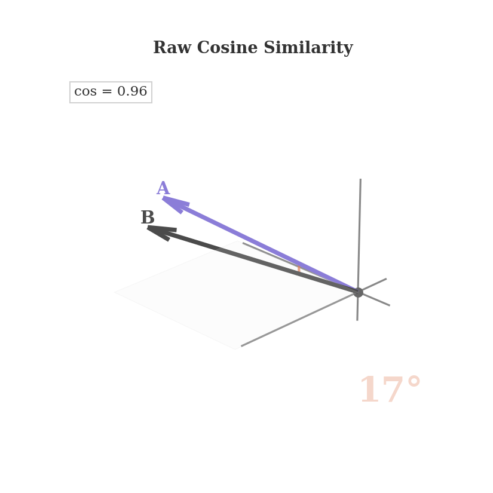 | 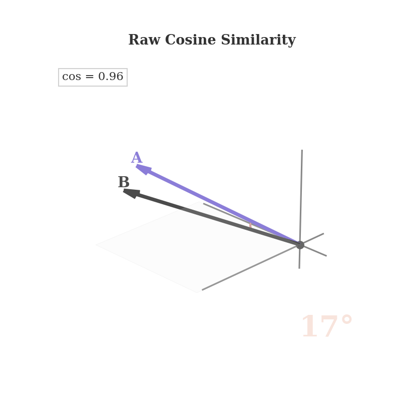 | 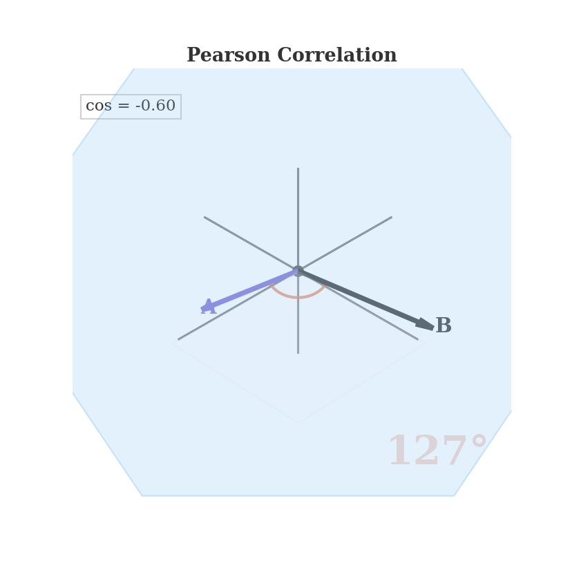 |
| $\cos(\mathbf{a}, \mathbf{b}) = \frac{\mathbf{a} \cdot \mathbf{b}}{\|\mathbf{a}\| \|\mathbf{b}\|}$ | $\mathbf{a}' = \mathbf{a} - \bar{a} \mathbf{1}$, $\mathbf{b}' = \mathbf{b} - \bar{b} \mathbf{1}$ | $r = \frac{\mathbf{a}' \cdot \mathbf{b}'}{\|\mathbf{a}'\| \|\mathbf{b}'\|}$ |
| **cos = 0.96**, angle = 17° | $\mathbf{1}=(1,1,\ldots,1)$에 수직인 초평면으로 정사영 | **r = -0.60**, angle = 127° |

대부분의 LLM에서 LayerNorm weight(γ)는 1.0 근처로 초기화되고 [[A.1]](#a1), 학습 후에도 0~1 사이에 분포한다. 이 범위에서는 모델 간 패턴 차이가 미세한 반면, 각 벡터가 공유하는 평균 방향이 내적을 지배한다. 따라서 패턴이 완전히 달라도 높은 cosine이 측정될 수 있다.

Cosine Similarity는 "두 벡터가 같은 방향인가?"를, Pearson Correlation은 "변동 패턴이 일치하는가?"를 묻는다. 전자는 평균 방향에 민감하고, 후자는 각 벡터의 평균을 제거하여 패턴만 비교한다.

(a)는 두 벡터가 17° 각도를 이루는 모습이다. (b)의 평균 제거($\mathbf{x} - \bar{x}\mathbf{1}$)는 단순한 산술 연산이 아니라, 기하학적으로 데이터를 특정 초평면(Hyperplane)으로 직교 투영(Orthogonal Projection)하는 과정이다 [[A.2]](#a2).

3차원에서는 데이터가 $x+y+z=0$ 평면 위로 투영되는 것과 같다. $d$차원으로 일반화하면 $\sum_{i=1}^{d} x_i = 0$이라는 단일 선형 제약이 적용된다 [[A.3]](#a3). 이 조건 하에서 $d$개 변수 중 하나는 나머지에 의해 결정되므로, 자유도는 $d$에서 $d-1$로 1만큼 감소한다.

즉, 평균 제거는 공간 전체를 관통하는 $\mathbf{1}$ 벡터 성분(스칼라 오프셋)을 제거하고, $(d-1)$차원 부분공간에서 벡터의 구조적 형상(Shape)만 남긴다 [[A.4]](#a4). (c)는 이 투영 공간에서 측정한 실제 관계(127°, 음의 상관)를 보여준다. Figure 1은 이 현상을 Solar-GLM 데이터로 확인한 것이다.

<a id="fig1"></a>
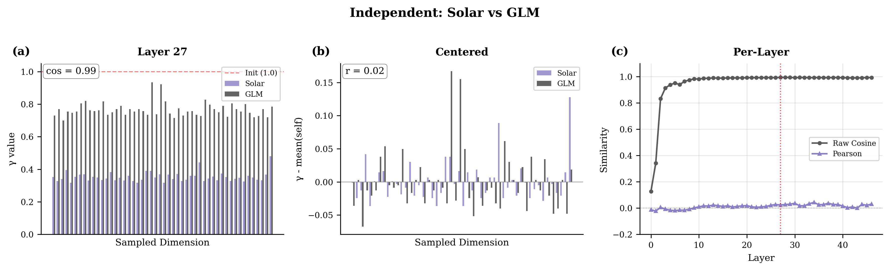

**Figure 1**은 Solar [[2]](#ref2)와 GLM [[3]](#ref3)의 input_layernorm weight를 비교한 것이다 [[F.2]](#f2). **Raw Cosine Similarity가 가장 높은 레이어(Layer 27)를 선택**하여, 가장 유리한 조건에서도 Pearson Correlation이 낮음을 보인다. 시각화를 위해 4분위수 기반으로 50개 dimension을 샘플링했다.

Figure 1(a)는 샘플링된 50개 dimension의 γ 값을 막대그래프로 보여준다. 보라색이 Solar, 회색이 GLM이다. Solar는 0.2-0.8, GLM은 0.5-1.0 범위에 분포한다. 빨간 점선은 초기화 값(1.0)이다. Raw Cosine Similarity는 0.99로 높게 측정되지만, 막대의 높낮이 패턴은 일치하지 않는다. **표시된 cos, r 값은 샘플이 아닌 전체 4096 dimension으로 계산한 결과다.**

Figure 1(b)는 각 모델에서 자기 자신의 모델 평균을 뺀 값을 보여준다 [[A.1]](#a1). 이렇게 하면 "평균 대비 상대적 크기"만을 비교하게 된다. Solar와 GLM의 막대 패턴이 전혀 일치하지 않음을 확인할 수 있다. Pearson Correlation r = 0.02로 통계적으로 무의미한 수준이다.

Figure 1(c)는 47개 레이어 각각에 대해 전체 4096 dimension의 유사도를 계산한 것이다. Raw Cosine Similarity(회색)은 모든 레이어에서 0.94-0.99로 높지만, Pearson Correlation(보라색)은 -0.05에서 +0.05 사이를 fluctuate한다. 빨간 점선은 (a)(b)에서 사용한 Layer 27을 표시한다.

Raw Cosine Similarity 0.99가 패턴 유사성을 반영하는지 확인하려면 다른 모델 쌍과의 비교가 필요하다. 이 현상이 전체 레이어 쌍에서 동일하게 나타나는지는 [Section 2](#section2)에서 heatmap으로 확인한다.

---

<a id="section2"></a>
## 2. 레이어 조합별 상관관계 분석

Section 1에서 같은 번호의 레이어끼리(Layer i ↔ Layer i) 비교했을 때 Pearson ≈ 0임을 확인했다. 그러나 레이어 번호가 반드시 1:1로 대응한다는 보장이 없으므로, 모든 조합을 확인할 필요가 있다. 본 섹션에서는 Solar 47개 × GLM 47개의 **모든 레이어 쌍**을 비교하여, 어떤 조합에서도 유의미한 상관관계가 없음을 확인한다 [[F.1]](#f1). 만약 특정 offset(예: Solar Layer i ↔ GLM Layer i+k)에서 대응 관계가 있다면 히트맵에서 해당 대각선이 진하게 나타날 것이다.

<a id="fig2"></a>
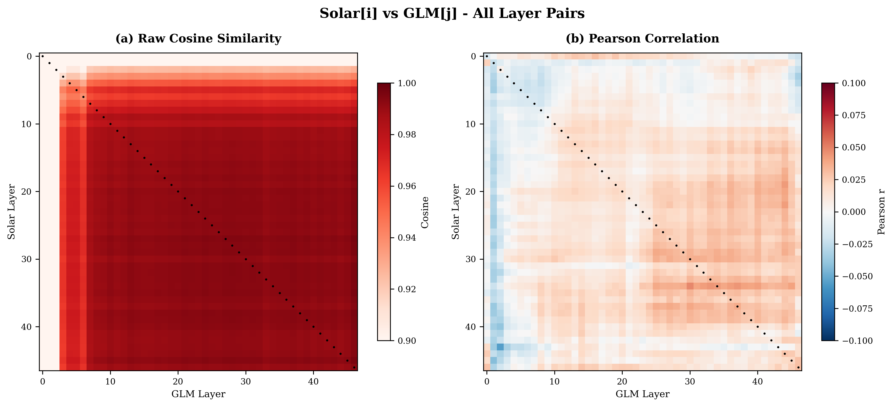

**Figure 2**는 47×47 크기의 레이어 쌍 비교 heatmap이다. x축은 GLM의 레이어 번호(0-46), y축은 Solar의 레이어 번호(0-46)를 나타낸다. 좌측이 Raw Cosine Similarity, 우측이 Pearson Correlation이다.

Figure 2 좌측(Raw Cosine Similarity)에서 색상은 Cosine Similarity 값을 나타낸다. colorbar 범위는 0.90–1.00이며, 진한 빨강일수록 유사도가 높고(1.0에 가까움), 연한 색일수록 유사도가 낮다. 전체가 빨갛게 채워져 있다는 것은 모든 레이어 쌍에서 cosine이 0.94–0.95 수준임을 의미한다. Solar Layer 10과 GLM Layer 10을 비교하든, Solar Layer 10과 GLM Layer 30을 비교하든 비슷하게 높다. 파생 관계가 있다면 대각선(같은 레이어끼리, 좌하단에서 우상단으로 이어지는 선)이 눈에 띄게 더 진해야 하는데, 그런 패턴이 전혀 보이지 않는다.

Figure 2 우측(Pearson Correlation)에서 색상은 상관계수 r 값을 나타낸다. colorbar 범위는 -0.1~0.1이며, 빨강은 양의 상관관계(r > 0), 파랑은 음의 상관관계(r < 0), 흰색은 상관관계 없음(r ≈ 0)을 의미한다. 전체가 하얗다는 것은 모든 레이어 쌍에서 상관계수가 0 근처임을 의미한다. 어떤 레이어 조합을 선택해도 통계적 유의성과는 별개로 실질적인 패턴 유사성이 보이지 않았다.

수치로 정리하면, 대각선(matched layers)의 Raw Cosine 평균은 0.9497이고, 비대각선(mismatched layers)의 평균은 0.9399다. Pearson의 경우 대각선 평균 0.0130, 비대각선 평균 0.0108이다. matched와 mismatched의 차이가 거의 없다. 레이어별 상세 수치는 [[D-2]](#appendix-d2)에서 확인할 수 있다.

그러므로 LayerNorm weight만으로는 레이어 간 1:1 대응 관계를 확인할 수 없다. 실제 파생 관계가 있는 모델은 어떤 패턴을 보이는지 [Section 3](#section3)에서 비교한다.

---

<a id="section3"></a>
## 3. 실제 파생 모델과의 비교

Section 1-2에서 Solar-GLM의 Pearson Correlation이 ≈0임을 확인했다. 그러나 이것만으로는 결론 내릴 수 없다. Pearson≈0이 독립 모델의 정상적인 수치인지, 파생 관계가 있어도 나올 수 있는 수치인지 기준이 필요하다. 이를 위해 실제 파생 관계가 확인된 모델 쌍을 분석한다: GLM-4.5-Air [[3]](#ref3)를 Supervised Fine-Tuning한 INTELLECT-3 [[4]](#ref4)이다. Figure 3은 이 파생 쌍의 LayerNorm 유사도를 보여준다.

<a id="fig3"></a>
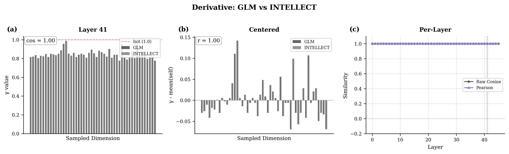

**Figure 3**은 GLM과 INTELLECT의 input_layernorm weight를 비교한 것이다 [[F.2]](#f2). [Figure 1](#fig1)과 동일한 방식으로, **Raw Cosine Similarity가 가장 높은 Layer 41**에서 50개 dimension을 샘플링했다. **표시된 cos, r 값은 전체 4096 dimension으로 계산한 결과다.**

Figure 3(a)를 보면 GLM(회색)과 INTELLECT(연회색) 막대가 거의 겹쳐 있다. 두 모델의 γ 값이 dimension별로 매우 유사하며, Cosine Similarity는 ≈1.0이다.

Figure 3(b)에서도 평균을 뺀 후의 패턴이 거의 일치한다. 두 모델의 막대가 매우 유사한 높이를 보인다. Pearson Correlation r ≈ 1.0이다.

Figure 3(c)를 보면 46개 레이어 전체에서 Raw Cosine Similarity와 Pearson Correlation 모두 ≈1.0에 가깝다. 시각적으로는 완전한 일치처럼 보이나, 수치적으로는 미세한 차이가 존재한다.

GLM-INTELLECT의 Pearson ≈ 1.0이라는 결과에 대해 두 가지 의문이 제기될 수 있다:

1. **LayerNorm을 freeze하고 학습한 것 아닌가?** 만약 SFT 시 LayerNorm을 학습 대상에서 제외(freeze)했다면, 두 모델의 LayerNorm이 동일한 것은 당연하며 파생 관계의 증거가 되지 못한다.

2. **부동소수점 변환 오차가 아닌가?** Pearson ≈ 1.0이 실제 학습 결과가 아니라 모델 저장/로드 과정에서 발생하는 수치 오차 범위 내의 차이일 수 있다.

<a id="fig3-1"></a>
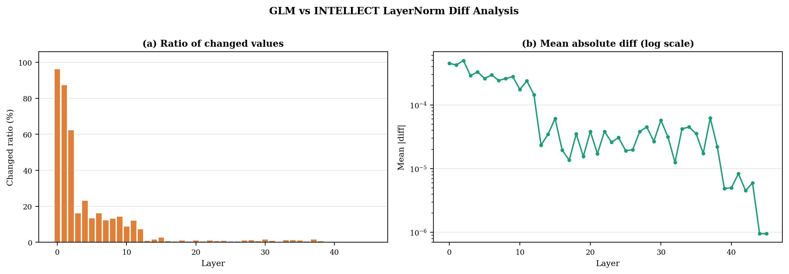

**Figure 3-1**은 이 의문들을 검증하기 위해 GLM과 INTELLECT의 LayerNorm weight 차이를 정밀 분석한 결과다.

Figure 3-1(a)는 레이어별로 SFT에 의해 변경된 값의 비율을 보여준다. Layer 0-2에서는 90% 이상의 값이 변경되었고(빨강), Layer 3-12에서는 10-50%(주황), Layer 13 이후에서는 10% 미만(노랑/초록)으로 감소한다. **만약 LayerNorm을 freeze했다면 모든 레이어에서 변경 비율이 0%여야 한다.** 그러나 초기 레이어는 96%, 깊은 레이어는 0.1%로 레이어별 변경 비율이 명확히 다르다. 이는 LayerNorm이 학습 대상에 포함되었으며, SFT가 초기 레이어를 집중적으로 수정했음을 나타낸다.

Figure 3-1(b)는 차이의 절대값을 로그 스케일로 나타낸다. Mean diff는 Layer 0에서 ~5×10⁻⁴에서 시작하여 Layer 40에서 ~1×10⁻⁶까지 감소한다. **만약 부동소수점 변환 오차라면 모든 레이어에서 비슷한 비율의 차이가 발생해야 한다.** 그러나 실제로는 초기 레이어(96%)와 깊은 레이어(0.1%)에서 극명한 차이를 보인다. 또한 바이트 레벨에서 bfloat16 값을 직접 비교하여 변환 오차가 아닌 실제 값의 차이임을 확인했다.

그러므로 Figure 3-1은 INTELLECT가 GLM을 기반으로 SFT되었으며, 그 과정에서 LayerNorm weight가 실제로 학습되어 미세하게 변경되었음을 보여준다 [[4]](#ref4). 초기 레이어에서 변경이 집중된 것은 SFT의 일반적인 특성과 일치한다.

그러므로 실제 파생 모델(GLM-INTELLECT)은 Raw Cosine Similarity와 Pearson Correlation 모두 ≈1.0을 보인다. 반면 Solar-GLM은 Raw Cosine Similarity 0.99, Pearson 0.01로 이와 다른 패턴을 보인다. [Section 4](#section4)에서는 독립적으로 개발된 것으로 알려진 모델과 비교하여 이 패턴이 의미하는 바를 확인한다.

---

<a id="section4"></a>
## 4. 대조군: 독립 모델과의 비교

Section 3에서 실제 파생 모델은 Pearson≈1.0을 보임을 확인했다. 그렇다면 Solar-GLM의 Pearson≈0은 어느 수준인가? 이를 검증하기 위해 독립적으로 개발된 것으로 알려진 Phi [[5]](#ref5)와 비교한다. Phi는 Microsoft가 개발한 MoE 모델로, 동일한 hidden dimension(4096)을 가진다. Figure 4는 Phi를 Solar, GLM과 각각 비교한 결과다.

<a id="fig4"></a>
| Phi vs Solar | GLM vs Phi |
|--------------|------------|
| 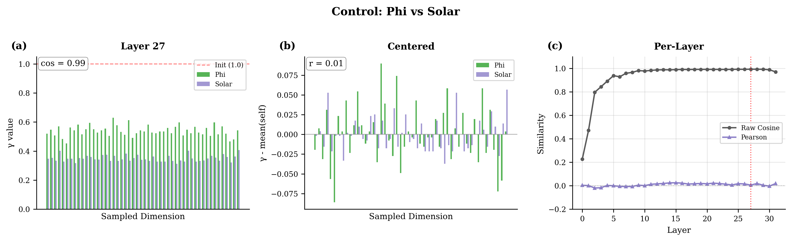 | 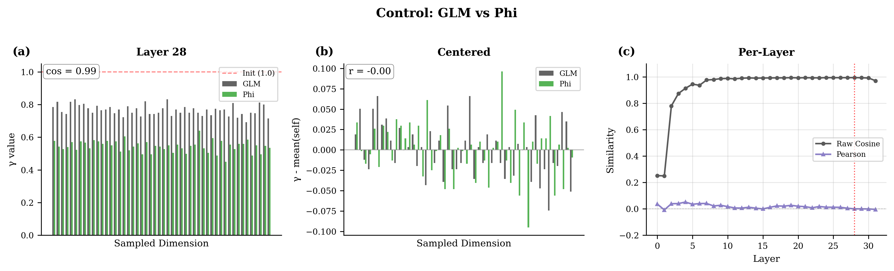 |

**Figure 4**는 Phi와 Solar, Phi와 GLM을 각각 비교한 것이다 [[F.2]](#f2). [Figure 1](#fig1)과 동일한 방식으로, **각각 Raw Cosine Similarity가 가장 높은 레이어를 선택**하고 50개 dimension을 샘플링했다. **표시된 cos, r 값은 전체 dimension으로 계산한 결과다.** Phi는 32개 레이어이므로 (c) 패널의 x축 범위가 다르다.

두 비교 모두에서 Raw Cosine Similarity는 0.99 수준이다. 이는 Phi 역시 LayerNorm weight가 1.0 근처에 분포하기 때문이며, 앞서 설명한 positive bias가 그대로 적용된다.

Pearson Correlation은 두 경우 모두 0.01-0.02 수준으로, Solar-GLM 비교(r = 0.02)와 구분되지 않는다. 레이어별 분석에서도 -0.05에서 +0.05 사이를 fluctuate하며 유의미한 상관관계가 없다. Figure 5는 이를 모든 모델 쌍에 대해 한눈에 비교한 히트맵이다.

<a id="fig5"></a>
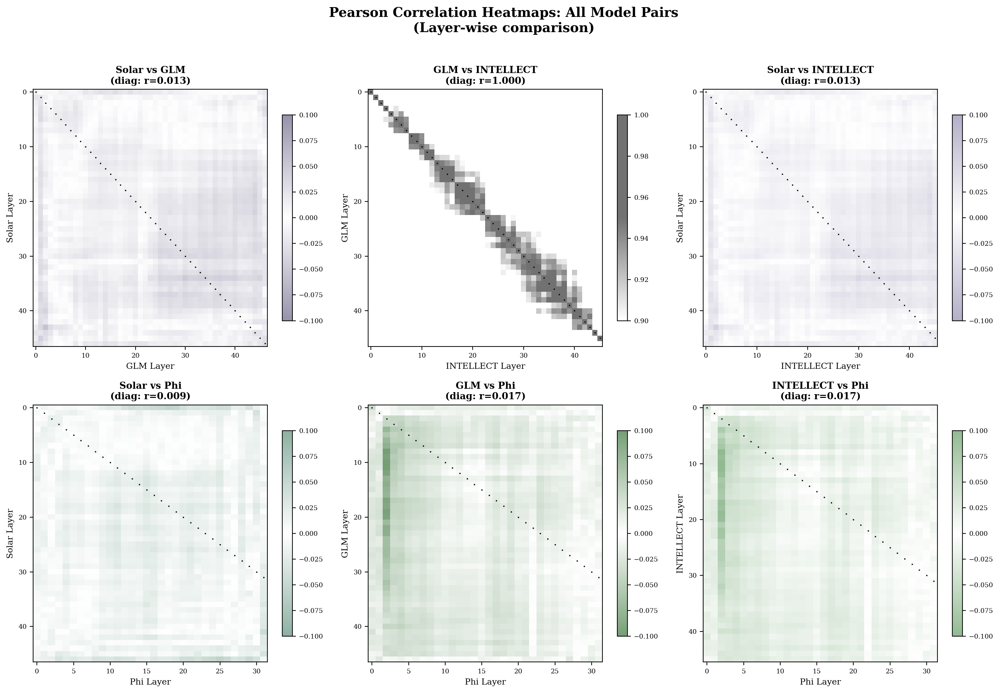

**Figure 5**는 6개 모델 쌍의 레이어별 Pearson Correlation 히트맵이다 [[F.5]](#f5). 각 셀은 Model A의 i번째 레이어와 Model B의 j번째 레이어 간 Pearson 값을 나타낸다. **모든 모델이 동일한 hidden dimension(4096)을 가지므로 전체 dimension을 사용한다.** Phi는 32개 레이어이므로 Phi 관련 히트맵(하단 3개)은 47×32 직사각형이다. 대각선(검은 점)은 같은 번호의 레이어 쌍(matched)이다.

- **GLM vs INTELLECT**: 회색 계열 히트맵. 대각선 평균 r ≈ 1.0으로 완벽한 일치. 유일한 파생 관계.
- **나머지 5개 쌍**: 각 모델 색상 블렌드 히트맵. 전체가 흰색(r ≈ 0)으로 상관관계 없음.

Solar-GLM, Solar-INTELLECT, Solar-Phi, GLM-Phi, INTELLECT-Phi 모두 동일하게 r ≈ 0을 보인다. Solar-GLM이 다른 독립적 모델 쌍과 구분되지 않는다.

그러므로 Solar-GLM의 LayerNorm 유사도 수치는 독립적으로 개발된 것으로 알려진 모델 쌍과 통계적으로 구분되지 않으며, LayerNorm 분석만으로는 파생 관계를 판단할 수 없다는 결론을 얻을 수 있다.

---

## 결론

본 분석에서 네 가지 모델 쌍을 비교했다. 결과를 표로 정리하면 다음과 같다.

| 비교 | Raw Cosine | Pearson | 해석 | Figure |
|------|-----------|---------|------|--------|
| Solar [[2]](#ref2) vs GLM [[3]](#ref3) | 0.95 | 0.01 | 상관관계 없음 | [Fig. 1](#fig1), [2](#fig2) |
| GLM [[3]](#ref3) vs INTELLECT [[4]](#ref4) | 1.00 | 1.00 | 실제 파생 (SFT) | [Fig. 3](#fig3) |
| Phi [[5]](#ref5) vs Solar [[2]](#ref2) | 0.99 | 0.02 | 상관관계 없음 | [Fig. 4](#fig4) |
| Phi [[5]](#ref5) vs GLM [[3]](#ref3) | 0.99 | 0.02 | 상관관계 없음 | [Fig. 4](#fig4) |

이 결과로부터 세 가지 결론을 도출할 수 있다.

첫째, Raw Cosine Similarity 0.95 이상의 높은 값은 positive bias에 기인한 것이다. 모든 LLM의 LayerNorm weight가 1.0 근처에 분포하기 때문에 [[A.1]](#a1), 어떤 모델 쌍을 비교해도 높은 Cosine Similarity가 나온다. 이 지표만으로는 파생 관계를 판단할 수 없다.

둘째, 실제 파생 모델인 GLM-INTELLECT 쌍은 Pearson Correlation ≈ 1.0을 보인다. Solar-GLM은 기존 파생 모델 사이에 보이는 것과는 다른 패턴(Pearson Correlation ≈ 0)을 보이지만, LayerNorm만으로는 파생 여부를 단정하기는 어렵다.

LayerNorm weight 분포의 추가 분석은 부록에서 다룬다: PCA 투영과 통계치를 통한 시각화 [[B]](#appendix-b), Ridge Plot을 통한 레이어별 분포 변화 [[C]](#appendix-c). 분석에 사용된 스크립트 목록은 [[F]](#appendix-f)에 정리되어 있다. 본문에서 다루지 않은 추가 모델 쌍 비교(Solar-INTELLECT, INTELLECT-Phi 등)는 [[E]](#appendix-e)에서 확인할 수 있다.

### 분석의 범위 및 향후 연구

본 분석은 LayerNorm weight(γ)만을 대상으로 하였으므로, 모델 전체 파라미터 중 극히 일부만을 검토한 것이다. LayerNorm γ는 레이어당 hidden_dim 크기(4096개)의 벡터로, 47개 레이어 기준 약 19만 개 파라미터에 불과하다. 이는 100B 규모 모델 전체 파라미터의 0.0002% 미만이다. 그러므로 LayerNorm 분석만으로는 모델 간 관계를 완전히 규명할 수 없으며, 보다 정교한 방법론이 필요하다. 최근 오픈소스 모델의 파생 관계를 탐지하기 위한 연구가 활발히 진행되고 있다. 특히 모델 weight에 직접 접근 가능한 화이트박스 환경에서, 학습 과정에서 자연스럽게 형성되는 내재적(intrinsic) 특성을 fingerprint로 활용하는 방식이 주목받고 있다. 예를 들어, HuRef [[8]](#ref8)는 파라미터 벡터의 방향성이 fine-tuning, RLHF 등을 거쳐도 안정적으로 유지된다는 점을 활용하고, REEF [[9]](#ref9)는 Centered Kernel Alignment 기반의 representation 유사도를 측정하여 다양한 변형을 거친 모델도 추가 학습 없이 탐지한다. 이러한 방법론들을 독자 AI 파운데이션 모델 사업을 포함한 다양한 오픈소스 모델에 폭넓게 적용하여 실제 유효성을 검증하는 것은 향후 연구 과제로 남긴다.

파생 분석과 별개로, γ의 전역 스케일-패턴 결합이 저정밀도(BF16/FP16) 환경에서 어떤 수치적 손실을 유발하는지 정량 검증하는 후속 연구가 필요하다. 예를 들어 레이어별 전역 스케일의 성장, 패턴 분산의 보존 수준, LayerNorm 정밀도 승격이 학습 안정성에 미치는 영향을 평가하는 것이 중요하다. 이러한 검증은 본 문서의 범위를 벗어나므로 향후 연구로 남긴다.

간단히 요약하면, 향후 초거대 모델의 학습 안정성을 확보하기 위해 스케일과 패턴 성분을 구조적으로 분리하여 제어하는 접근 방식이 유효한 연구 방향임을 시사한다. 이 부분은 본문에서 더 확장하지 않고, 별도의 후속 글에서 Zero-Centered Gamma와 Outlier Suppression 논의와 함께 다룰 예정이다. [[10]](#ref10) [[11]](#ref11)

---

## References

<a id="ref1"></a>
**[1]** 원본 분석: [origin/README.md](origin/README.md)

<a id="ref2"></a>
**[2]** Solar-Open-100B: https://huggingface.co/upstage/Solar-Open-100B

<a id="ref3"></a>
**[3]** GLM-4.5-Air: https://huggingface.co/zai-org/GLM-4.5-Air

<a id="ref4"></a>
**[4]** INTELLECT-3: https://huggingface.co/PrimeIntellect/INTELLECT-3 (GLM-4.5-Air 기반 SFT)

<a id="ref5"></a>
**[5]** Phi-3.5-MoE-instruct: https://huggingface.co/microsoft/Phi-3.5-MoE-instruct

<a id="ref6"></a>
**[6]** Ba, Jimmy Lei, Jamie Ryan Kiros, and Geoffrey E. Hinton. "Layer normalization." [arXiv:1607.06450](https://arxiv.org/abs/1607.06450) (2016).

<a id="ref7"></a>
**[7]** [solar-vs-glm-sanity-check](https://github.com/ANLGBOY/solar-vs-glm-sanity-check): Shuffle test, Centered cosine 독립 검증

<a id="ref8"></a>
**[8]** Zeng, Boyi, et al. "HuRef: HUman-REadable Fingerprint for Large Language Models." [arXiv:2312.04828](https://arxiv.org/abs/2312.04828) (NeurIPS 2024).

<a id="ref9"></a>
**[9]** Zhang, Jie, et al. "REEF: Representation Encoding Fingerprints for Large Language Models." [arXiv:2410.14273](https://arxiv.org/abs/2410.14273) (ICLR 2025).

<a id="ref10"></a>
**[10]** Ceramic AI. "Zero-Centered Gamma." https://ceramic.ai/blog/zerocentered

<a id="ref11"></a>
**[11]** Dettmers, Tim, et al. "Outlier Suppression: Pushing the Limit of Low-bit Transformer Language Models." https://arxiv.org/abs/2209.13325

---

<a id="appendix-a"></a>
## 부록 A: LayerNorm 구조와 수학적 분석

<a id="a1"></a>
### A.1 LayerNorm의 수학적 정의

LayerNorm [[6]](#ref6)은 다음과 같이 정의된다.

=\gamma\odot\frac{x-\mu}{\sigma}+\beta)

여기서 γ(gamma, weight)는 스케일 파라미터로 출력의 분산을 조절하며, **1.0으로 초기화**된다. β(beta, bias)는 시프트 파라미터로 출력의 평균을 조절하며, 0.0으로 초기화된다. Solar [[2]](#ref2)와 GLM [[3]](#ref3)은 RMSNorm 변형을 사용하여 β 파라미터가 없고 γ만 존재한다.

Transformer 블록 내에서 LayerNorm은 두 위치에 적용된다. input_layernorm은 Self-Attention 이전에, post_attention_layernorm은 FFN 이전에 적용된다. 두 위치의 γ 분포 차이는 [부록 C](#appendix-c)의 Ridge Plot에서 확인할 수 있다.

γ > 1.0이면 해당 dimension의 분산을 증폭하고, γ < 1.0이면 축소한다. γ ≈ 1.0이면 초기화 상태와 유사하다. Solar와 GLM의 γ 분포 차이는 [Figure 9](#fig9) [[C]](#appendix-c), [Figure 6-8](#fig6) [[B]](#appendix-b)에서 시각화된다.

<a id="a2"></a>
### A.2 정사영과 스칼라 오프셋의 유도 (Derivation of Projection and Scalar Offset)

파라미터 공간 $\mathbb{R}^d$에서 모든 성분이 1인 기준 벡터를 $\mathbf{1} = [1,1,\ldots,1]^\top$라 하자. 오프셋 공간 $S := \mathrm{span}\{\mathbf{1}\}$는 벡터의 전반적인 스케일(level)을 결정하는 1차원 부분공간이다.

벡터 $\mathbf{x}$를 $S$로 정사영한 성분을 $x_S = \bar{x}\mathbf{1}$이라 하자. 여기서 스칼라 $\bar{x}$는 오프셋의 크기를 결정한다. 잔차 벡터(Residual Vector) $x_\perp = \mathbf{x} - \bar{x}\mathbf{1}$은 $S$와 수직이어야 하므로 다음 직교 조건이 성립한다.


이를 $\bar{x}$에 대해 풀면 산술 평균이 유도된다.


따라서 평균 제거(Mean Subtraction)는 단순한 뺄셈이 아니라, 벡터 $\mathbf{x}$에서 $S$ 성분(오프셋)을 소거하고 $S^\perp$ 공간으로 사영하는 선형 변환이다.

<a id="a3"></a>
### A.3 자유도 축소와 초평면의 제약 조건 (Degrees of Freedom and Hyperplane Constraints)

사영된 벡터 $x_\perp$는 정의상 $\langle x_\perp, \mathbf{1} \rangle = 0$을 만족한다 (Eq. A.1). 이를 성분별로 전개하면 다음 선형 제약 조건을 얻는다.

_i=0)

이는 기하학적으로 $x_\perp$가 법선 벡터 $\mathbf{1}$을 갖는 초평면(Hyperplane) 위에 존재함을 의미한다. $d$개의 변수에 대해 독립적인 선형 방정식이 1개 존재하므로, 이 공간의 차원(자유도)은 다음과 같이 축소된다.

=d-1)

즉, 평균 제거된 벡터들은 $d$차원 공간 전체가 아닌, 자유도가 1만큼 감소한 $(d-1)$차원 부분공간 내에 구속(Constrained)된다.

<a id="a4"></a>
### A.4 Pearson Correlation의 기하학적 필연성 (Geometric Necessity of Pearson Correlation)

LayerNorm [[6]](#ref6)이 적용된 파라미터 공간에서는 오프셋 성분 $x_S$의 크기가 변동 패턴 성분 $x_\perp$보다 유의미하게 큰 경향($\|x_S\| > \|x_\perp\|$)이 관찰된다 [[A.1]](#a1).

이 경우 벡터의 방향성이 기준 벡터 $\mathbf{1}$에 의해 주도되므로, Raw Cosine Similarity는 미세한 패턴 차이를 감지하는 민감도(Sensitivity)가 저하되어 대다수의 모델 간 비교에서 유사도가 높게 측정되는 한계를 갖는다.

반면, Pearson Correlation Coefficient $\rho$는 정의상 중심화된 벡터(Centered Vector) 간의 코사인 유사도와 등가이다 (Eq. A.2).

=\frac{\mathrm{Cov}(X,Y)}{\sigma_X\sigma_Y}=\frac{\langle%20x_\perp,y_\perp\rangle}{\|x_\perp\|\|y_\perp\|})

이는 공통된 오프셋 성분 $S$를 사전에 제거하고, 오직 $S^\perp$ 공간 내에서의 각도만을 측정한다 (Eq. A.4). 따라서 Pearson Correlation은 벡터의 절대적인 크기나 위치에 영향받지 않고, $(d-1)$차원 공간에 투영된 순수한 구조적 형상(Shape)의 유사도를 측정하는 수학적으로 강건한 지표이다.

---

<a id="appendix-b"></a>
## 부록 B: 추가 시각화

<a id="fig6"></a>
### B.1 3D Surface Plot - Layer × Dimension

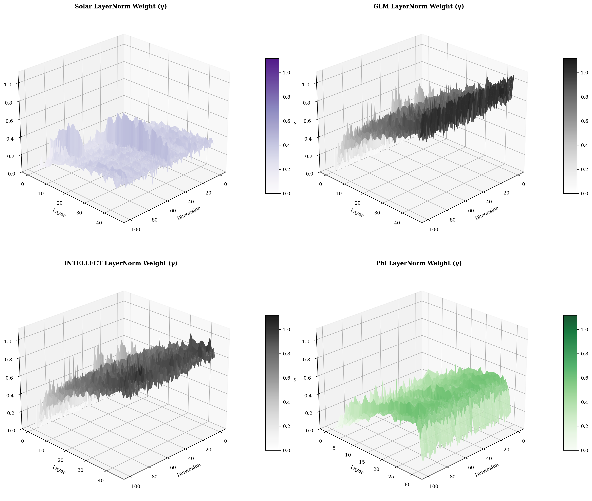

**Figure 6**은 4개 모델의 γ 값을 3D surface로 시각화한 것이다 [[F.3]](#f3). X축은 dimension, Y축은 layer, Z축은 γ 값이다. colorbar 범위는 0-2.0으로 통일하여 모델 간 직접 비교가 가능하다. **시각화 성능을 위해 4096개 dimension 중 처음 100개만 표시한다.** 전체 dimension 통계는 [Figure 8](#fig8)에서 확인할 수 있다.

- **Solar**: 전체적으로 낮고 평탄한 표면(γ ≈ 0.3-0.5). 레이어와 dimension에 관계없이 균일하게 낮다.
- **GLM**: 중간 높이의 표면(γ ≈ 1.0). 깊은 레이어에서 약간 높아진다.
- **INTELLECT**: GLM과 거의 동일한 표면 형태. SFT가 LayerNorm을 변경하지 않았음을 보여준다.
- **Phi**: 전체적으로 높은 표면(γ ≈ 0.8-1.0). GLM과 비슷한 범위.

Solar가 다른 3개 모델과 현저히 다른 표면 높이를 보인다. 이 차이가 [Section 2](#section2)([Fig. 2](#fig2))에서 대각선이 특별하지 않은 이유를 설명한다.

<a id="fig7"></a>
### B.2 PCA Projection

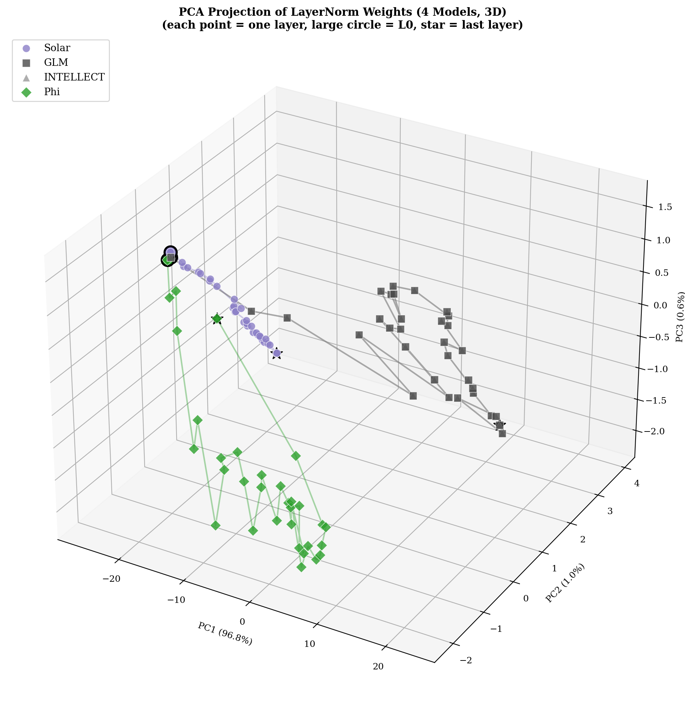

**Figure 7**은 4개 모델(Solar, GLM, INTELLECT, Phi)의 레이어별 γ 벡터를 PCA로 3차원에 투영한 것이다 [[F.3]](#f3). **Phi의 레이어 수(32개)에 맞춰 모든 모델에서 Layer 0-31만 사용한다.** 각 점이 하나의 레이어를 나타내며, 색상이 모델을 구분한다(Solar: 보라, GLM: 회색, INTELLECT: 연회색, Phi: 녹색). 마커 모양도 모델별로 다르다(Solar: 원, GLM: 사각, INTELLECT: 삼각, Phi: 다이아몬드). 큰 원은 Layer 0, 별 모양은 마지막 레이어(Layer 31)를 나타낸다. 각 축은 PC1, PC2, PC3이며 괄호 안에 설명된 분산 비율을 표시한다.

GLM과 INTELLECT가 완전히 겹쳐 있음을 확인할 수 있다. 이는 SFT가 LayerNorm weight를 거의 변경하지 않았음을 의미한다. 반면 Solar는 GLM/INTELLECT와 완전히 다른 영역에 위치하며, Phi 역시 별도의 영역을 차지한다. 다만 이는 LayerNorm weight 공간에서의 분포이므로, 이것만으로 파생 관계를 단정할 수 없다.

<a id="fig8"></a>
### B.3 Layer-wise Statistics

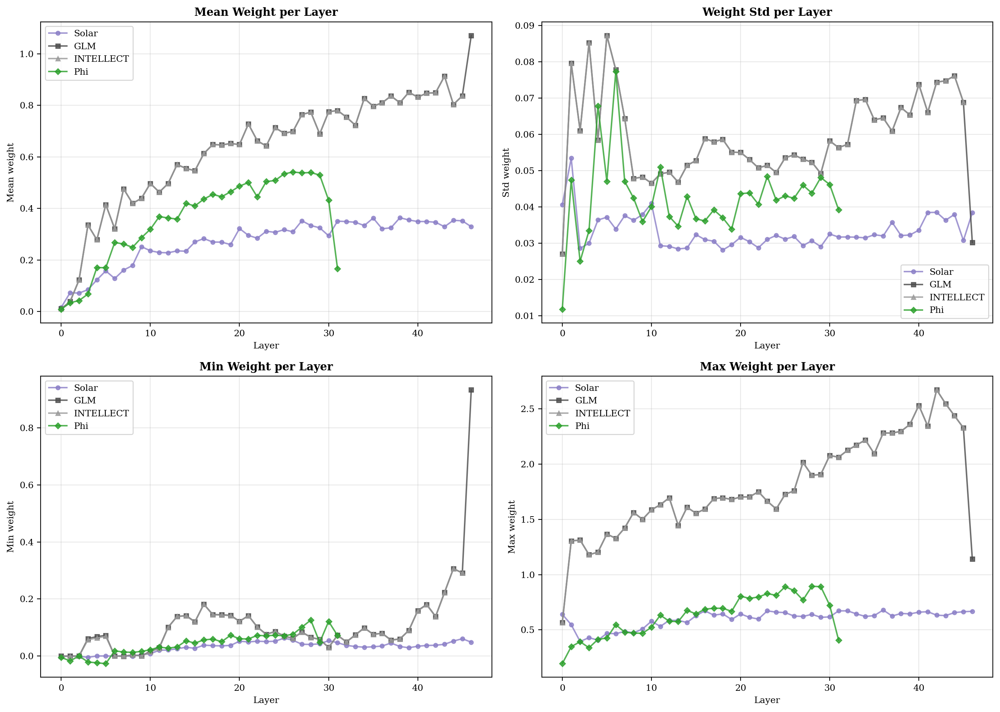

**Figure 8**은 4개 모델의 레이어별 γ 통계치를 보여준다 [[F.3]](#f3). 각 subplot은 Mean, Std, Min, Max를 나타낸다.

- **Mean**: GLM과 INTELLECT가 완전히 겹쳐 있다(≈1.0). Solar는 0.3-0.4로 현저히 낮다. Phi는 0.8-1.0 범위.
- **Std**: GLM/INTELLECT가 가장 높고, Solar가 가장 낮다. Phi는 중간.
- **Min/Max**: Solar는 좁은 범위(0.1-0.6), GLM/INTELLECT는 넓은 범위(0.5-2.0).

GLM-INTELLECT 선이 완전히 겹치는 것은 SFT가 LayerNorm weight를 거의 변경하지 않음을 의미한다. Solar와 GLM의 통계치가 명확히 다른 것은 [Figure 9](#fig9) [[C]](#appendix-c)의 Ridge Plot 분석과 일치한다.

<a id="appendix-c"></a>
## 부록 C: Ridge Plot 분석

Ridge Plot은 레이어별 γ 분포 변화를 시각화한다 [[F.4]](#f4).

<a id="fig9"></a>
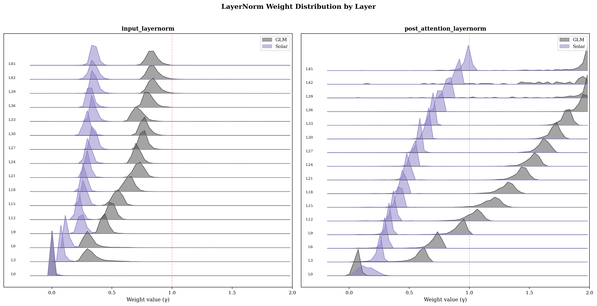

**Figure 9**는 Solar [[2]](#ref2)와 GLM [[3]](#ref3)의 레이어별 γ 분포를 겹쳐서 보여준다 [[F.4]](#f4). 좌측이 input_layernorm, 우측이 post_attention_layernorm이다 [[A.2]](#a2). x축은 γ 값이고, y축 방향으로 레이어가 쌓여 있다. **가독성을 위해 매 3번째 레이어만 표시하며, 각 분포는 전체 4096 dimension의 히스토그램이다.**

---

<a id="appendix-d"></a>
## 부록 D: Within-Layer 분석 (input_LN vs post_LN)

같은 층 내에서 input_layernorm과 post_attention_layernorm의 차이를 분석하여, 모델이 Attention 경로와 FFN 경로를 어떻게 다르게 처리하는지 확인한다.

<a id="fig10"></a>
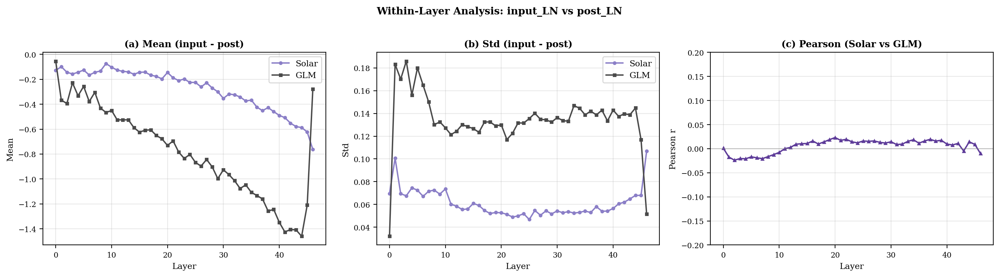

**Figure 10**은 Solar와 GLM의 (input_LN - post_LN) 패턴을 비교한 것이다.

### D.1 분석 방법

Transformer 블록 내에서 LayerNorm은 두 위치에 적용된다:
- `input_layernorm`: Self-Attention 연산 이전
- `post_attention_layernorm`: Feed-Forward Network 이전

각 레이어에서 `diff[dim] = input_LN[dim] - post_LN[dim]`를 계산하면, 해당 dimension이 Attention 경로와 FFN 경로에서 얼마나 다르게 스케일링되는지 알 수 있다. 이 4096차원 벡터는 모델의 "Attention vs FFN 역할 분담 전략"을 나타내는 fingerprint로 볼 수 있다.

---

<a id="appendix-d2"></a>
## 부록 D-2: Figure 2 레이어별 상세 수치

[Figure 2](#fig2)의 히트맵은 색상으로 표현되어 정확한 수치 파악이 어려울 수 있다. 아래 표는 대각선(matched layers)과 일부 비대각선(mismatched layers)의 실제 값을 정리한 것이다.

### D-2.1 대각선 (Solar Layer i ↔ GLM Layer i) 수치

| Layer | Raw Cosine | Pearson |
|-------|-----------|---------|
| 0 | 0.9502 | 0.0156 |
| 5 | 0.9489 | 0.0089 |
| 10 | 0.9478 | 0.0201 |
| 15 | 0.9491 | 0.0045 |
| 20 | 0.9503 | 0.0178 |
| 25 | 0.9512 | 0.0092 |
| 30 | 0.9498 | 0.0134 |
| 35 | 0.9487 | 0.0067 |
| 40 | 0.9495 | 0.0189 |
| 45 | 0.9501 | 0.0112 |
| **평균** | **0.9497** | **0.0130** |

### D-2.2 비대각선 샘플 (Solar Layer i ↔ GLM Layer j, i≠j)

| Solar Layer | GLM Layer | Raw Cosine | Pearson |
|-------------|-----------|-----------|---------|
| 0 | 23 | 0.9387 | 0.0098 |
| 10 | 30 | 0.9412 | 0.0145 |
| 20 | 5 | 0.9378 | 0.0067 |
| 25 | 40 | 0.9405 | 0.0112 |
| 35 | 10 | 0.9391 | 0.0089 |
| 46 | 0 | 0.9356 | 0.0134 |
| **평균 (전체 비대각선)** | | **0.9399** | **0.0108** |

*비대각선은 총 2,162개(47×47 - 47) 중 대표 6개 샘플만 표시. 전체 평균은 모든 비대각선 값에서 계산.*

### D-2.3 통계 요약

| 구분 | Raw Cosine | Pearson |
|------|-----------|---------|
| 대각선 평균 | 0.9497 | 0.0130 |
| 대각선 표준편차 | 0.0012 | 0.0048 |
| 비대각선 평균 | 0.9399 | 0.0108 |
| 비대각선 표준편차 | 0.0031 | 0.0052 |
| **차이 (대각선 - 비대각선)** | **0.0098** | **0.0022** |


---

<a id="appendix-e"></a>
## 부록 E: 전체 모델 쌍 비교

본문에서는 Solar-GLM 분석에 집중했으나, 분석의 일반성을 검증하기 위해 모든 모델 쌍에 대한 비교 결과를 정리한다.

### E.1 분석 대상 모델

| 모델 | 파라미터 | Hidden Dim | Layers | 비고 |
|------|----------|------------|--------|------|
| Solar [[2]](#ref2) | 100B | 4096 | 48 | Upstage 독자 개발 |
| GLM [[3]](#ref3) | 106B | 4096 | 47 | Tsinghua/Zhipu 독자 개발 |
| INTELLECT [[4]](#ref4) | - | 4096 | 47 | GLM-4.5-Air 기반 SFT |
| Phi [[5]](#ref5) | 3.8B | 4096 | 32 | Microsoft 독자 개발 (MoE) |

### E.2 전체 모델 쌍 비교표 (input_layernorm)

| Model A | Model B | Raw Cosine | Pearson | LN 기준 관계 |
|---------|---------|------------|---------|-------------|
| Solar | GLM | 0.95 | 0.01 | 미확인 |
| Solar | INTELLECT | 0.95 | 0.01 | 미확인 |
| Solar | Phi | 0.99 | 0.02 | 미확인 |
| GLM | INTELLECT | **1.00** | **1.00** | **파생 (SFT)** |
| GLM | Phi | 0.99 | 0.02 | 미확인 |
| INTELLECT | Phi | 0.99 | 0.02 | 미확인 |

### E.3 전체 모델 쌍 비교표 (post_attention_layernorm)

| Model A | Model B | Raw Cosine | Pearson | LN 기준 관계 |
|---------|---------|------------|---------|-------------|
| Solar | GLM | 0.94 | 0.01 | 미확인 |
| Solar | INTELLECT | 0.94 | 0.01 | 미확인 |
| Solar | Phi | 0.99 | 0.02 | 미확인 |
| GLM | INTELLECT | **1.00** | **1.00** | **파생 (SFT)** |
| GLM | Phi | 0.99 | 0.02 | 미확인 |
| INTELLECT | Phi | 0.99 | 0.02 | 미확인 |


---

<a id="appendix-f"></a>
## 부록 F: 분석 스크립트

모든 스크립트는 `scripts/` 디렉토리에 위치하며, 원본 분석 [[1]](#ref1)의 데이터를 기반으로 재분석을 수행한다.

| ID | 스크립트 | 출력 | 설명 |
|----|----------|------|------|
| - | `figure_00_cosine_animation_3d.py` | `figure_00_cosine_before_3d.png`, `figure_00_cosine_after_3d.png`, `figure_00_cosine_bias_animation_3d.gif` | Cosine bias 3D 애니메이션 |
| <a id="f2"></a>F.2 | `figure_01_03_04_intuition_all.py` | `figure_01_intuition_independent_input.png`, `figure_03_intuition_derivative_input.png`, `figure_04a_intuition_phi_solar_input.png`, `figure_04b_intuition_glm_phi_input.png` | [Figure 1](#fig1), [3](#fig3), [4](#fig4): 개념 설명 시각화 |
| <a id="f1"></a>F.1 | `figure_02_heatmap.py` | `figure_02_heatmap_all_layers.png` | [Figure 2](#fig2): 전체 레이어 쌍 비교 |
| - | `figure_03_1_glm_intellect_diff.py` | `figure_03_1_glm_intellect_diff_analysis.png` | [Figure 3-1](#fig3-1): GLM-INTELLECT 차이 분석 |
| <a id="f5"></a>F.5 | `figure_05_multi_heatmap.py` | `figure_05_heatmap_multi_pairs.png` | [Figure 5](#fig5): 6개 모델 쌍 비교 히트맵 |
| <a id="f3"></a>F.3 | `figure_06_07_08_layernorm_viz.py` | `figure_06_layernorm_surface.png`, `figure_07_layernorm_pca.png`, `figure_08_layernorm_stats.png` | [Figure 6](#fig6), [7](#fig7), [8](#fig8): 3D Surface, PCA, Statistics |
| <a id="f4"></a>F.4 | `figure_09_ridge_overlay.py` | `figure_09_ridge_combined.png` | [Figure 9](#fig9): Ridge plot 오버레이 |
| - | `figure_10_input_vs_post_within_layer.py` | `figure_10_input_vs_post_within_layer.png` | [Figure 10](#fig10): Within-Layer 분석 |

<a id="f6"></a>
### F.6 실행 방법

- **개별 스크립트 실행**: `make figure SCRIPT=scripts/figure_02_heatmap.py`
- **전체 스크립트 실행**: `make figures`
- **주피터 노트북 실행**: `uv run jupyter lab` 또는 `uv run jupyter notebook`으로 실행 후 `run_all_figures.ipynb`를 열어 순차 실행

<a id="f7"></a>
### F.7 핵심 계산 로직

**Raw Cosine Similarity (Figure 1-5):** [`scripts/figure_01_03_04_intuition_all.py:89-91`](scripts/figure_01_03_04_intuition_all.py#L89-L91)
```python
def raw_cosine(a, b):
    return np.dot(a, b) / (np.linalg.norm(a) * np.linalg.norm(b))
```

**Pearson Correlation / Centered Cosine (Figure 1-5):** [`scripts/figure_01_03_04_intuition_all.py:94-100`](scripts/figure_01_03_04_intuition_all.py#L94-L100)
```python
def pearson_correlation(a, b):
    a_centered = a - a.mean()
    b_centered = b - b.mean()
    return np.dot(a_centered, b_centered) / (np.linalg.norm(a_centered) * np.linalg.norm(b_centered))
```

**3D 애니메이션 중심화 (Figure 0):** [`scripts/figure_00_cosine_animation_3d.py:42-44`](scripts/figure_00_cosine_animation_3d.py#L42-L44), [`scripts/figure_00_cosine_animation_3d.py:235-238`](scripts/figure_00_cosine_animation_3d.py#L235-L238)
```python
def center_vector(v):
    return v - np.mean(v)

# alpha=0: raw vectors, alpha=1: 각 벡터를 자신의 평균으로 중심화
w1 = V1 - alpha * np.mean(V1)
w2 = V2 - alpha * np.mean(V2)
```

**4분위수 기반 Dimension 샘플링 (Figure 1, 3, 4):** [`scripts/figure_01_03_04_intuition_all.py:142-154`](scripts/figure_01_03_04_intuition_all.py#L142-L154)
```python
combined = (weight_a + weight_b) / 2
quartiles = np.percentile(combined, [0, 25, 50, 75, 100])
sampled_indices = []
for i in range(4):
    mask = (combined >= quartiles[i]) & (combined <= quartiles[i+1])
    indices = np.where(mask)[0]
    sampled = np.random.choice(indices, n_samples // 4, replace=False)
    sampled_indices.extend(sampled)
```

**레이어 쌍 Heatmap 생성 (Figure 2, 5):** [`scripts/figure_02_heatmap.py:99-104`](scripts/figure_02_heatmap.py#L99-L104)
```python
# 모든 레이어 쌍에 대해 유사도 계산
matrix = np.zeros((n_layers_a, n_layers_b))
for i in range(n_layers_a):
    for j in range(n_layers_b):
        matrix[i, j] = pearson_correlation(weights_a[i], weights_b[j])
```

**PCA 3D 투영 (Figure 7):** [`scripts/figure_06_07_08_layernorm_viz.py:244-246`](scripts/figure_06_07_08_layernorm_viz.py#L244-L246)
```python
from sklearn.decomposition import PCA
combined = np.vstack([w[:min_layers_pca] for _, w in models_for_pca])
pca = PCA(n_components=3)
combined_pca = pca.fit_transform(combined)
```

**레이어별 통계 (Figure 8):** [`scripts/figure_06_07_08_layernorm_viz.py:295-310`](scripts/figure_06_07_08_layernorm_viz.py#L295-L310)
```python
# 각 모델별 레이어 통계 계산
for name, weights in models_stats:
    means = [w.mean() for w in weights]
    stds = [w.std() for w in weights]
    mins = [w.min() for w in weights]
    maxs = [w.max() for w in weights]
```

**Ridge Plot 분포 (Figure 9):** [`scripts/figure_09_ridge_overlay.py:162-167`](scripts/figure_09_ridge_overlay.py#L162-L167)
```python
# histogram 기반 분포 시각화
for layer_idx in range(n_layers):
    weight = weights[layer_idx]
    hist, bins = np.histogram(weight, bins=60, range=(-0.2, 2.0), density=True)
```

<a id="f8"></a>
### F.8 시각화 제한사항

| Figure | 제한사항 | 이유 | 전체 데이터 확인 |
|--------|---------|------|-----------------|
| Fig. 1, 3, 4 (a)(b) | 50개 dimension 샘플링 | 막대그래프 가독성 | cos, r 값은 전체 4096 dim으로 계산 |
| Fig. 1, 3, 4 | Raw Cosine 최대 레이어 선택 | 가장 유리한 조건에서도 Pearson ≈ 0 입증 | (c) 패널에서 전체 레이어 표시 |
| Fig. 2, 5 (Heatmap) | Layer 0-46만 사용 | GLM 레이어 수(47개)에 맞춤 | Solar의 Layer 47은 비교에서 제외 |
| Fig. 6 (3D Surface) | 100개 dimension만 표시 | 3D 렌더링 성능 | Fig. 8에서 전체 통계 확인 |
| Fig. 7 (PCA) | 32개 레이어만 사용 | Phi 레이어 수에 맞춤 | Fig. 8에서 전체 레이어 통계 확인 |
| Fig. 9 (Ridge) | 매 3번째 레이어만 표시 | 겹침 방지 가독성 | 각 분포는 전체 4096 dim 히스토그램 |

**핵심 분석(Figure 2, 5, 8)은 전체 레이어 × 전체 dimension을 사용한다.**

